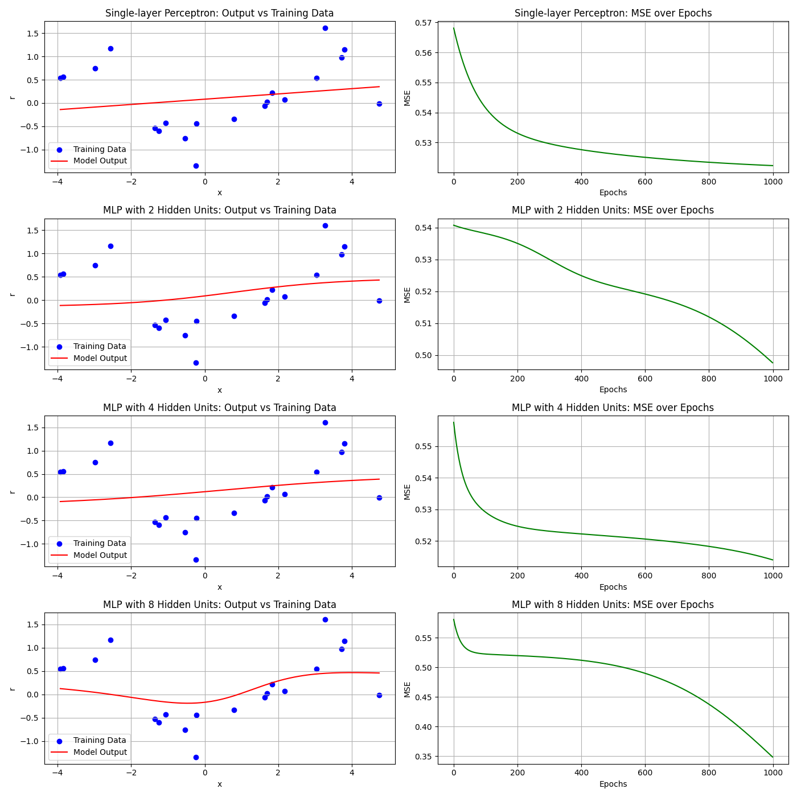
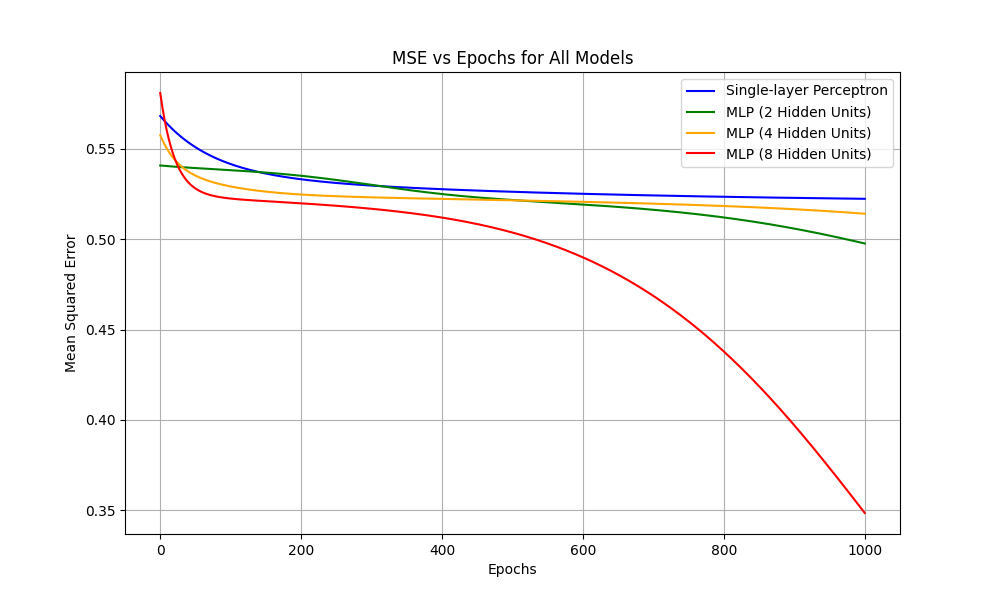
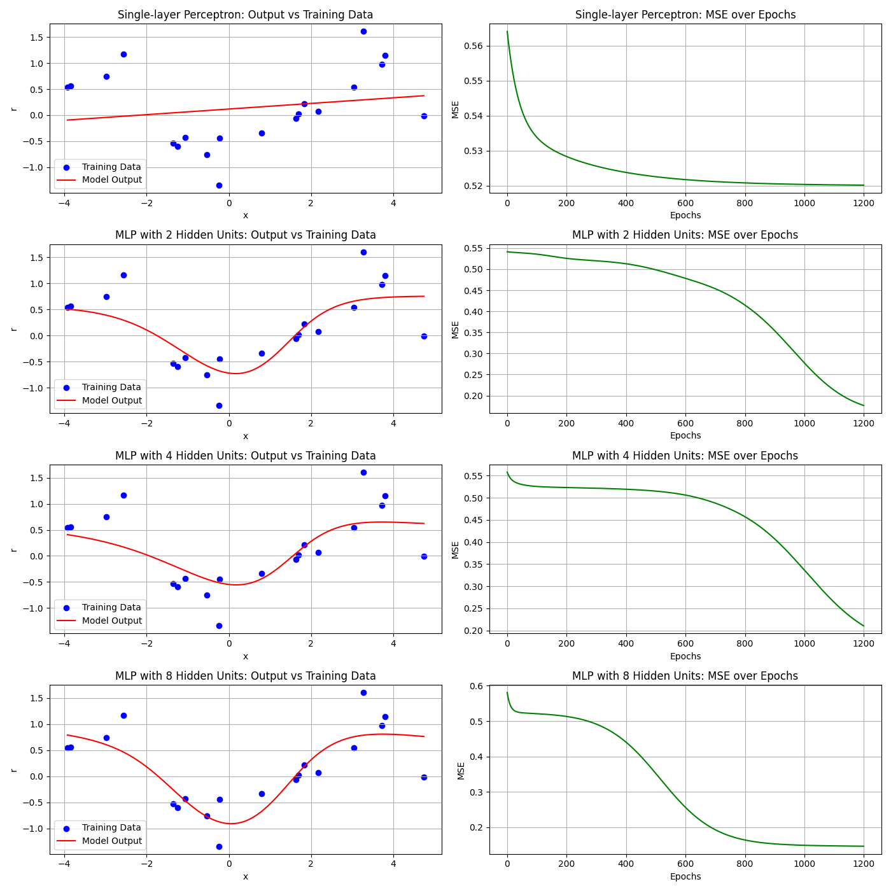
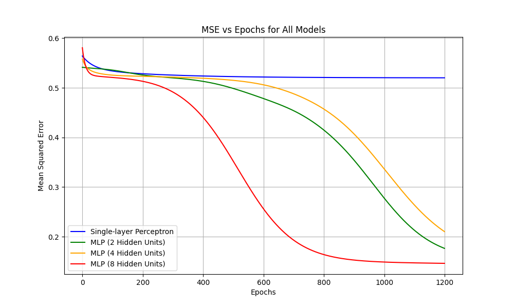
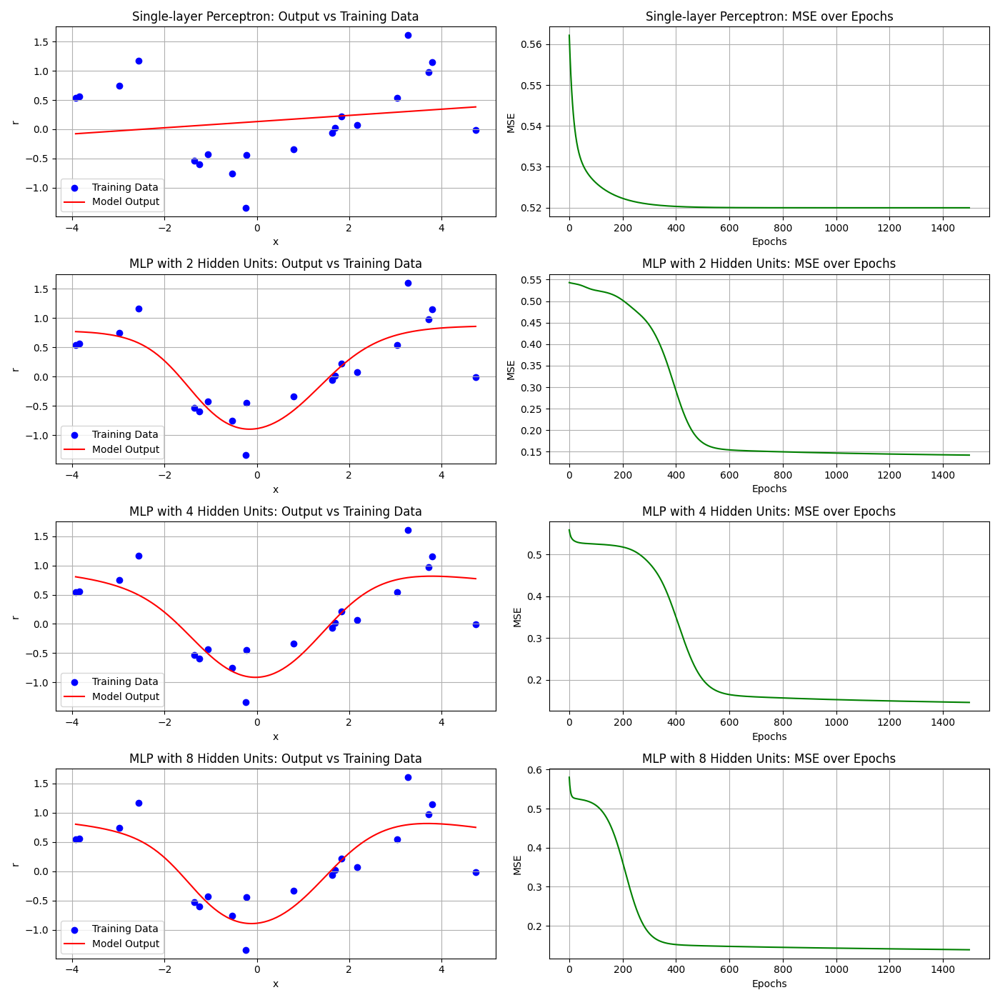
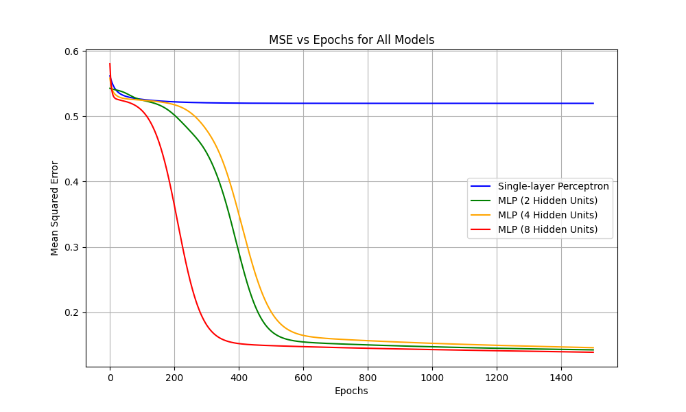

# CS454-554 Homework 3: Single- and Multi-Layer Perceptrons for Regression  
**Spring 2024/2025**

**Student Name:** DEMBA SOW

**Submission Date:** April 30, 2025  

---

## Objective

The objective of this homework is to implement and analyze single- and multi-layer perceptrons for **regression** using backpropagation. We evaluate the models on a small training dataset (20 instances) and a larger test dataset (80 instances). 

We trained four different models:

- **a)** Single-layer perceptron (no hidden layer)
- **b)** MLP with 2 hidden units
- **c)** MLP with 4 hidden units
- **d)** MLP with 8 hidden units

The hidden layer uses the **tanh activation function**, and training is done via online gradient descent. We analyze:
- Model output after convergence
- MSE vs. Epochs
- Model complexity vs. training/test error

## Derivation of Update Rules Using Tanh Activation

Let:

- Input $ \mathbf{x} \in \mathbb{R}^d $
- Desired output $ r \in \mathbb{R} $
- Predicted output $ y \in \mathbb{R} $
- Hidden units: $ z = \tanh(Wx) $
- Output layer: $ y = Vz $

### Loss function (MSE):

$
E = \frac{1}{2}(r - y)^2
$

### Gradient w.r.t. output weights:

$
\frac{\partial E}{\partial V} = -(r - y) \cdot z
$

### Gradient w.r.t. hidden weights:

Using the derivative of tanh:

$
\frac{dz}{da} = 1 - z^2
$

$
\frac{\partial E}{\partial W} = -(r - y) \cdot V \cdot (1 - z^2) \cdot x
$

These updates are used in the backpropagation algorithm for each MLP configuration.

## Code Summary

- **Libraries used**: `numpy`, `pandas`, `matplotlib`
- **No machine learning libraries** (e.g., PyTorch, sklearn) were used.
- Training is done using **online gradient descent**.
- All models use a bias term in both the input and hidden layers.
- Training and test data were loaded from `train.csv` and `test.csv`.

### Training Parameters
| Parameter       | Value          |
|----------------|----------------|
| Learning Rate  | 0.002 (best case) |
| Epochs         | 1200 (best case) |
| Activation     | `tanh` in hidden layer |
| Optimizer      | Online gradient descent |

## Comparison of Learning Rates and Epoch Counts

In this section, we compare how different learning rates (`lr`) and number of epochs affect model performance. We tested the following combinations:

| Trial | Learning Rate | Epochs | Notes |
|-------|---------------|--------|-------|
| 1     | 0.001         | 1000   | Conservative, slow learning |
| 2     | 0.002         | 1200   | Balanced, steady descent |
| 3     | 0.005         | 1500   | Faster convergence, risk of instability |

Each trial was run across the same 4 network configurations (0, 2, 4, 8 hidden units). For each setting, we examined:

- The **network output vs training data** (to assess fit)
- The **MSE vs epochs** curve (to assess convergence behavior)

---

### 📊 Trial 1: `lr = 0.001`, `epochs = 1000`

**Interpretation**:
- The MSE curves descend **very slowly**, especially in deeper models (4 and 8 hidden units).
- Final MSE is still relatively high compared to other trials.
- The model output plots underfit the data — the learned function is too flat or simple.
- Conclusion: **Learning rate is too low**, and the model struggles to converge even after 1000 epochs.

---

### 📊 Trial 2: `lr = 0.002`, `epochs = 1200`

**Interpretation**:
- MSE curves decrease **smoothly and quickly**, especially for MLPs with 4 and 8 hidden units.
- Final MSE is lower than in Trial 1, and curves flatten out by 1000–1100 epochs.
- Output plots match the training data well without overfitting.
- Conclusion: This setting achieves the **best trade-off between learning speed and stability**.

---

### 📊 Trial 3: `lr = 0.005`, `epochs = 1500`

**Interpretation**:
- Learning curves drop **very quickly**, but the initial part may be a bit erratic (especially for deeper models).
- Slight signs of **overshooting or instability** in the early epochs of MSE curves.
- Output plots are accurate but start to show signs of overfitting (e.g., slight waviness or wiggles in MLP-8).
- Conclusion: While fast, this learning rate **may be too aggressive**. It still works, but caution is advised.

---

## ✅ Best Setting and Why

Based on visual inspection of MSE curves and output fitting:

- `lr = 0.002`, `epochs = 1200` provides the **best balance**
- The models converge efficiently, with smooth and stable MSE curves.
- No major overfitting or underfitting is observed.
- Deeper networks (4 and 8 units) perform well under this configuration.

This trial was used for the final figures and complexity/error comparisons in the rest of the report.

## Network Complexity vs Training/Test Error

We compare model complexity (number of hidden units) with performance:

| Hidden Units | Train MSE | Test MSE |
|--------------|-----------|----------|
| 0 (Single)   | 0.5201075065693169 | 0.46971444253270833 |
| 2            | 0.17513155631115968 | 0.2916760754687775 |
| 4            | 0.2082469935784501 | 0.29569419103898575|
| 8            | 0.1445559566750335 | 0.33610903563487315 |

**Observation**:
- As the number of hidden units increases, training error decreases.
- However, test error may plateau or increase slightly, indicating **overfitting** beyond 4 or 8 units.

## Conclusion

This homework demonstrated how perceptrons and multi-layer perceptrons can be used for regression tasks. Key findings include:

- **Single-layer perceptrons** are insufficient for modeling complex nonlinear relationships.
- **MLPs** with 2–4 hidden units significantly improve performance.
- Beyond 4–8 hidden units, we observed **diminishing returns** or **overfitting**.
- The learning rate and epoch settings greatly influence the stability and convergence of training.

This project reinforces the importance of architecture tuning and hyperparameter search in neural network design.